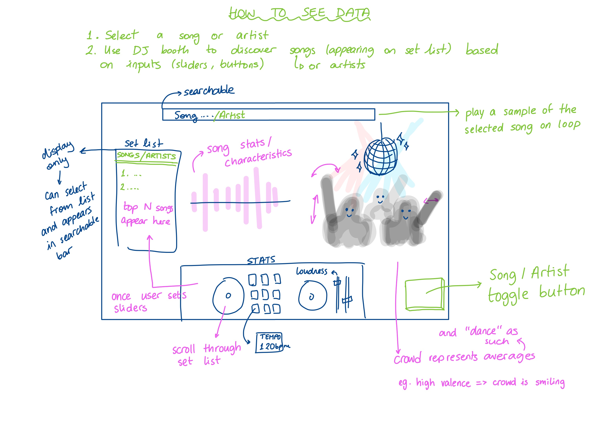

# Project of Data Visualization (COM-480)

| Student's name | SCIPER |
| -------------- | ------ |
| Christopher Williams | 300174 |
| Stefan Popescu | 299558 |
| Anne-Marie Rusu | 296098 |
| Simon Gmür | 303207 |

[Milestone 1](#milestone-1) • [Milestone 2](#milestone-2) • [Milestone 3](#milestone-3)

## Milestone 1 (29th March, 5pm)


### Dataset

https://www.kaggle.com/datasets/julianoorlandi/spotify-top-songs-and-audio-features/data

Our dataset contains the songs from the top 200 charts on Spotify for each year since 2016, their respective artists and number of streams, as well as the audio features of each song. The dataset is updated regularly (with new charts data), and the latest update at the time of writing was carried out on March 10th.

The data is complete and requires very little preprocessing or cleaning, and can be worked with directly for the most part. A closer look at the dataset and an explanation is carried out in the "EDA" interactive notebook found in the ```Milestone 1``` folder.

As of March 10th 2024, there are currently 6513 entries in the dataset, each entry represents a track, with its associated artists, Spotify statistics such as the number of streams, the number of weeks on the top charts, and a few very interesting descriptive and musical features such as "key", "energy", "danceability", time signature and many others which are further explored in the Python notebook. 

### Problematic

The aim of our visualization is to present the various characteristics of a selected song in a fun and appealing way (i.e. a crowd dancing faster or slower based on the song tempo). Simultaneously, the values of these characteristics will be represented as bar graphs, imitating the look of a sound wave with each bar representing a different characteristic. A DJ table placed at the bottom of the page allows for filtering desired characteristics, as well as playing a snippet of the song. More concretely, the DJ table consists of multiple interactable buttons and sliders corresponding to the different song features (key, tempo, duration, ...), which allows the user to find songs based on specific combinations of desired criteria. 

In a similar fashion, a toggle between songs and artists allows artists’ average song characteristics to be filtered and presented. This enables the user to find artists who produce a certain style of music, once again using the DJ table as a controller. Naturally, should the user not wish to use the filters, it is possible to search for songs and artists directly through a search bar at the top of the page.

Overall, we aim to provide a novel and intuitive tool for analyzing songs and artists, as well as discovering new songs. All of that wrapped up in a single easy-to-use, fun, and visually appealing frame.

The current target audience ranges from teenagers to young adults who would like to discover more about their favorite songs (as they were the target demographic of music released since 2016). It could also include professional DJs or movie directors looking for songs that fit specific criteria.

We want to provide a practical visualization of song features that, even if tracked, are not often presented when using an app such as Spotify. However for those curious, we believe that the data should be available, and in our case aim to provide full control over searching based on these criteria. Instead of relying on genres, stereotypes, albums, and specific playlists, we explore a different approach to presenting songs and artists. As a result, we hope to come across unexpected discoveries and create a visualization that could be generalized to a dataset beyond only the Top 200 charts.

Here is a visual prototype sketch that will hopefully aid in understanding the goal of the project: 


### Exploratory Data Analysis

The EDA was performed in a Python interactive notebook, which can be found [here](Milestone1/EDA.ipynb).


### Related work

- What others have already done with the data?

While Spotify data has been used for many different visualizations over the years, most of these cases explore the popularity (and its evolution) of specific songs and artists. While it is an interesting approach to the data, it has been overdone and lacks the level of detail that our approach aims to achieve.

- Why is your approach original?

Our approach uses the top charts dataset, however, we utilize the specific audio characteristics of each song rather than the number of streams. We are not interested in how popular songs are, but rather the features that make up the songs. This allows us to visualize the artists as more than just a number that represents popularity, instead displaying them as an average of their compositions' features, defining their style.       

- What source of inspiration do you take? Visualizations that you found on other websites or magazines (might be unrelated to your data).

Given the music-oriented dataset, we inspired ourselves from a typical nightclub scene, playing the role of DJ. In this role, we use our turntable for full control over the type of music being played, allowing us to choose songs based on desired features. For each selection, we can observe the effect of our song choice on the partygoers, who will react accordingly to the tempo and liveness. As any good DJ has a prepared setlist of songs that fit together, our visualization presents a list of songs that match a given criteria, allowing us to search our extensive library for the perfect match.     

## Milestone 2 (26th April, 5pm)

**10% of the final grade**

PDF can be found [here](Milestone2/DataViz%20Milestone%202.pdf)

Prototype Website [here](https://com-480-data-visualization.github.io/project-2024-cmsgang/)

## Milestone 3 (31st May, 5pm)

**80% of the final grade**

